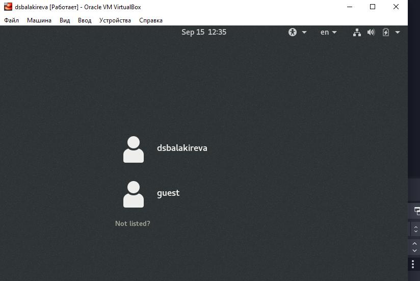
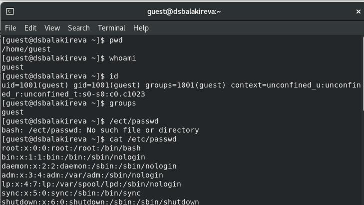
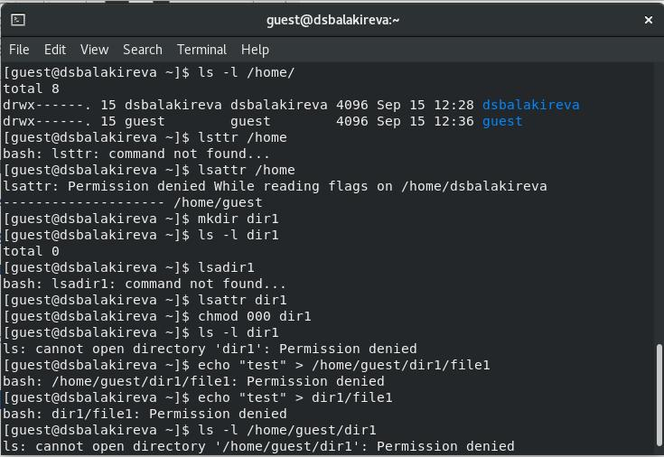

---
## Front matter
lang: ru-RU
title: "Лабораторная работа No 2"
subtitle: "Дискреционное разграничение прав в Linux. Основные атрибуты" 
author:
  -  Балакирева Д. С.
institute:
  - Российский университет дружбы народов, Москва, Россия
date: 16 сентября 2022

## i18n babel
babel-lang: russian
babel-otherlangs: english

## Formatting pdf
toc: false
toc-title: Содержание
slide_level: 2
aspectratio: 169
section-titles: true
theme: metropolis
header-includes:
 - \metroset{progressbar=frametitle,sectionpage=progressbar,numbering=fraction}
 - '\makeatletter'
 - '\beamer@ignorenonframefalse'
 - '\makeatother'
---

## Докладчик

:::::::::::::: {.columns align=center}
::: {.column width="70%"}

  * Балакирева Дарья Сергеевна
  * Студент НПМбд-01-19б
  * Российский университет дружбы народов

:::
::::::::::::::

## Цели 
1. Получение практических навыков работы в консоли с атрибутами файлов
2. Закрепление теоретических основ дискреционного разграничения доступа в современных системах с открытым кодом на базе ОС Linux.

##  Выполнение
Создание учётной записи

{ #fig:1 width=70% }

##
{ #fig:2 width=70% }

##
{ #fig:3 width=70% }
 
##
{ #fig:4 width=100% }

##
{ #fig:5 width=100% }

##  Вывод
Получила практические навыки работы в консоли с атрибутами файлов, закрепил теоретические основы дискреционного разграничения доступа в современных системах с открытым кодом на базе ОС Linux.
 

