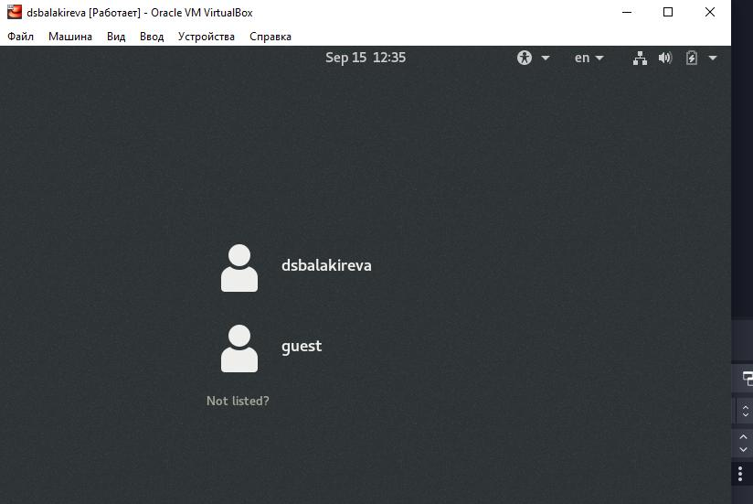
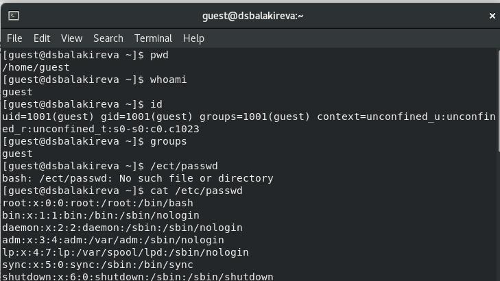
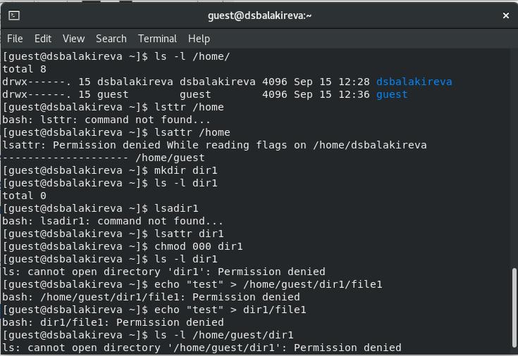

---
## Front matter
title: "Лабораторная работа No 2"
subtitle: "Дискреционное разграничение прав в Linux. Основные атрибуты"
author: " Балакирева Дарья Сергеевна"

## Generic otions
lang: ru-RU
toc-title: "Содержание"

## Bibliography
bibliography: bib/cite.bib
csl: pandoc/csl/gost-r-7-0-5-2008-numeric.csl

## Pdf output format
toc: true # Table of contents
toc-depth: 2
lof: true # List of figures
lot: true # List of tables
fontsize: 12pt
linestretch: 1.5
papersize: a4
documentclass: scrreprt
## I18n polyglossia
polyglossia-lang:
  name: russian
  options:
	- spelling=modern
	- babelshorthands=true
polyglossia-otherlangs:
  name: english
## I18n babel
babel-lang: russian
babel-otherlangs: english
## Fonts
mainfont: PT Serif
romanfont: PT Serif
sansfont: PT Sans
monofont: PT Mono
mainfontoptions: Ligatures=TeX
romanfontoptions: Ligatures=TeX
sansfontoptions: Ligatures=TeX,Scale=MatchLowercase
monofontoptions: Scale=MatchLowercase,Scale=0.9
## Biblatex
biblatex: true
biblio-style: "gost-numeric"
biblatexoptions:
  - parentracker=true
  - backend=biber
  - hyperref=auto
  - language=auto
  - autolang=other*
  - citestyle=gost-numeric
## Pandoc-crossref LaTeX customization
figureTitle: "Рис."
tableTitle: "Таблица"
listingTitle: "Листинг"
lofTitle: "Список иллюстраций"
lotTitle: "Список таблиц"
lolTitle: "Листинги"
## Misc options
indent: true
header-includes:
  - \usepackage{indentfirst}
  - \usepackage{float} # keep figures where there are in the text
  - \floatplacement{figure}{H} # keep figures where there are in the text
---

# Цель работы
1. Получение практических навыков работы в консоли с атрибутами файлов
2. Закрепление теоретических основ дискреционного разграничения доступа в современных системах с открытым кодом на базе ОС Linux.

# Теоретическое введение

Здесь описываются теоретические аспекты, связанные с выполнением работы.

Например, в табл. [-@tbl:std-dir] приведено краткое описание стандартных каталогов Unix.

: Описание некоторых каталогов файловой системы GNU Linux {#tbl:std-dir}

| Имя каталога | Описание каталога                                                                                                          |
|--------------|----------------------------------------------------------------------------------------------------------------------------|
| `/`          | Корневая директория, содержащая всю файловую                                                                               |
| `/bin `      | Основные системные утилиты, необходимые как в однопользовательском режиме, так и при обычной работе всем пользователям     |
| `/etc`       | Общесистемные конфигурационные файлы и файлы конфигурации установленных программ                                           |
| `/home`      | Содержит домашние директории пользователей, которые, в свою очередь, содержат персональные настройки и данные пользователя |
| `/media`     | Точки монтирования для сменных носителей                                                                                   |
| `/root`      | Домашняя директория пользователя  `root`                                                                                   |
| `/tmp`       | Временные файлы                                                                                                            |
| `/usr`       | Вторичная иерархия для данных пользователя                                                                                 |

Более подробно об Unix см. в [@gnu-doc:bash;@newham:2005:bash;@zarrelli:2017:bash;@robbins:2013:bash;@tannenbaum:arch-pc:ru;@tannenbaum:modern-os:ru].

# Выполнение лабораторной работы
Создаём новую учётную запись guest, используя команду useradd guest.

После этого зададим пароль с помощью команды passwd guest, используя учетную запись администратора и входим в систему от имени пользователя guest. 

Создание учётной записи

{ #fig:1 width=70% }

Определяем директорию, в которой находимся, с помощью команды pwd. Сравнивая с приглашением командной строки, определяем сходство и факт, что это наша домашнаяя директория.

Командой whoami уточняем имя пользователя - guest.

Уточним имя пользователя, его группу, а также группы, куда входит пользователь, командой id. Получаем результат 1002.

Далее сравним вывод id c приглашением командной строки, обнаружим, что имя пользователя повторяется.

Просмотрим файл /etc/passwd командой cat /etc/passwd. 

{ #fig:2 width=70% }

Найдём в нём свою учётную запись. Определим uid пользователя. Определите gid пользователя. Сравним найденные значения с полученными в предыдущих пунктах - они одинаковые.

Определим существующие в системе директории командой ls -l /home/. Нам удалось получить список поддиректорий. У каждой из них установлены права на чтение, запись и выполнение только для самого пользователя.

Проверяем, какие расширенные атрибуты установлены на поддиректориях, находящихся в директории /home, командой: lsattr /home

Нам удалось увидеть расширенные атрибуты директории, но не удалось увидеть расширенные атрибуты директорий других пользователей.

Создадим в домашней директории поддиректорию dir1 командой mkdir dir1

Определим командами ls -l и lsattr, какие права доступа и расширенные атрибуты были выставлены на директорию dir1.

Снимем с директории dir1 все атрибуты командой chmod 000 dir1 и проверим с её помощью правильность выполнения команды ls -l. 

{ #fig:3 width=70% }

Попытаемся создать в директории dir1 файл file1 командой echo "test" > /home/guest/dir1/file1, но получим отказ от выполнения, так как шагом ранее сняли все атрибуты с директории. Проверим, действительно ли файл не создался, с помощью команды ls -l /home/guest/dir1.

Заполним таблицу «Установленные права и разрешённые действия».

{ #fig:4 width=100% }

Заполним таблицу «Минимальные права для совершения операций». 

{ #fig:5 width=70% }

# Выводы
Получила практические навыки работы в консоли с атрибутами файлов, закрепил теоретические основы дискреционного разграничения доступа в современных системах с открытым кодом на базе ОС Linux.
# Список литературы{.unnumbered}

::: {#refs}
:::
