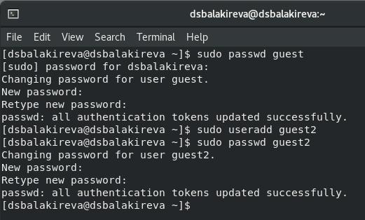
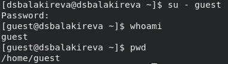
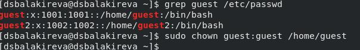
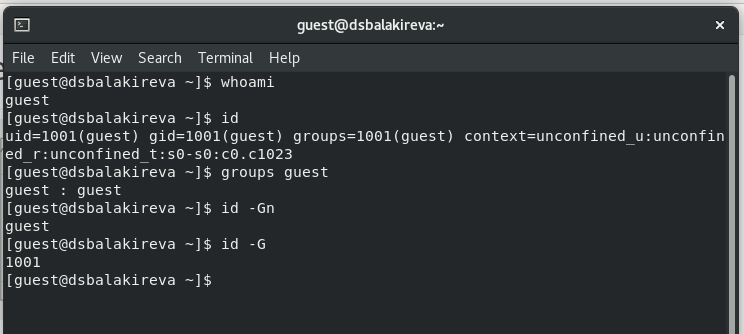
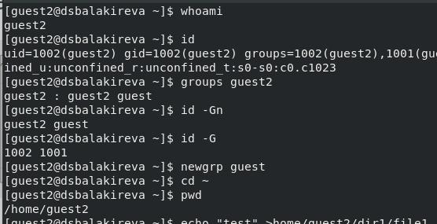
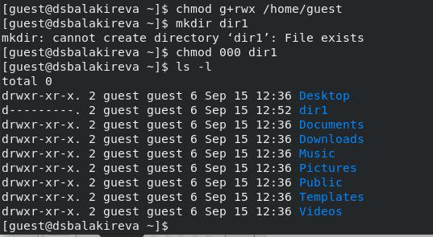
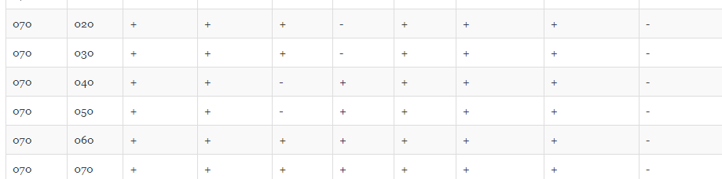
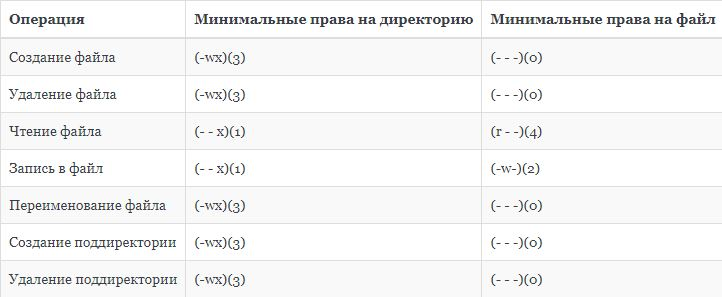

---
## Front matter
lang: ru-RU
title: " Лабораторная работа №3"
subtitle: "Дискреционное разграничение прав в Linux. Два пользователя"
author: 
  - Балакирева Д. С.
institute:
  - Российский университет дружбы народов, Москва, Россия
date: 19  сентября 2022

## i18n babel
babel-lang: russian
babel-otherlangs: english

## Formatting pdf
toc: false
toc-title: Содержание
slide_level: 2
aspectratio: 169
section-titles: true
theme: metropolis
header-includes:
 - \metroset{progressbar=frametitle,sectionpage=progressbar,numbering=fraction}
 - '\makeatletter'
 - '\beamer@ignorenonframefalse'
 - '\makeatother'
---
# Работа с атрибутами файлов для групп пользователей

## Цель выполнения лабораторной работы

- Получение практических навыков работы в консоли с атрибутами файлов для групп пользователей.

## Создание учетных записей

- Создал новые учетные записи guest и guest2

- Задал пароль, используя учетную запись администратора

{ #fig:1 width=70% }

## Вход в систему от двух пользователей

- Добавил пользователя guest2 в группу guest

- Осуществил вход в систему от двух пользователей на двух разных консолях

{ #fig:2 width=50% }

{ #fig:3 width=70% }

## Принадлежность к группам

- Уточнил имя пользователя, id -Gn, id -G, /etc/group

{ #fig:4 width=50% }

{ #fig:6 width=40% }

## Права и атрибуты

- От имени пользователя guest изменяем права директории /home/guest

- От имени пользователя guest снимаем с директории /home/guest/dir1 все атрибуты

{ #fig:5 width=70% }

## Таблица 3.1

- Установленные права и разрешённые действия
{ #fig:7 width=50% }

{ #fig:8 width=50% } 

{ #fig:9 width=50% } 

{ #fig:10 width=50% }

## Таблица 3.2

- Минимальные права для совершения операций

{ #fig:11 width=70% }

## Выводы

- Получила практические навыки работы в консоли с атрибутами файлов для групп пользователей.

:::

