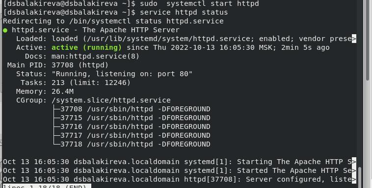
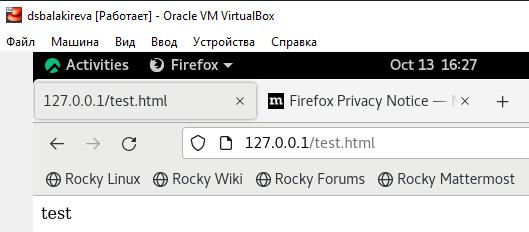
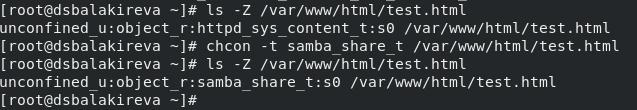
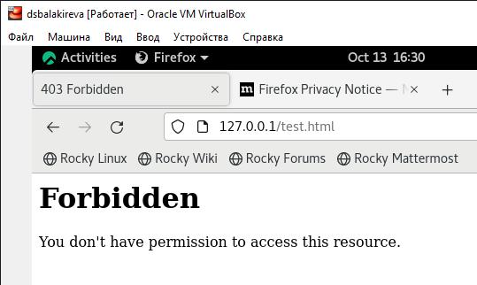
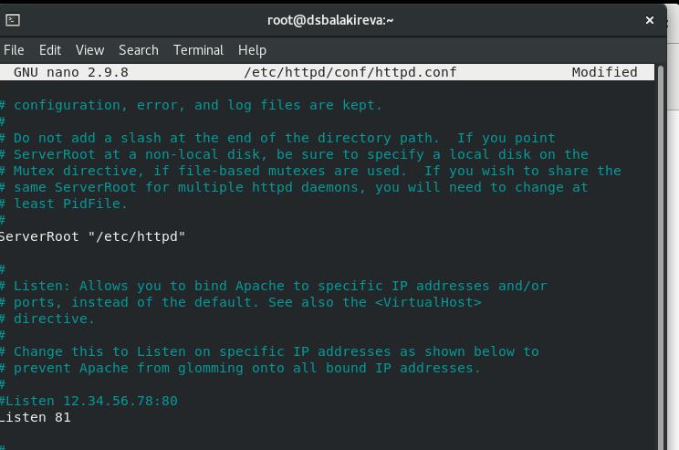
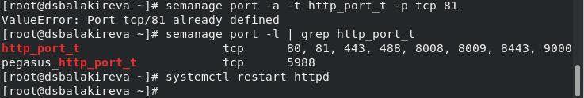
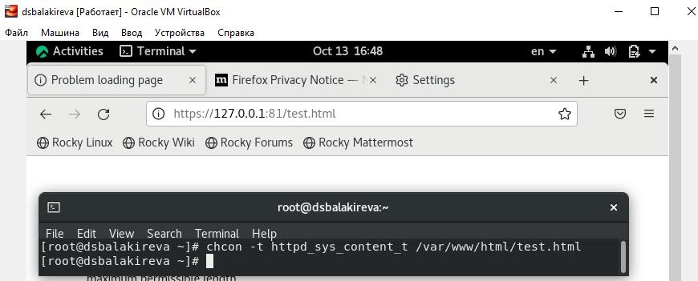

---
## Front matter
lang: ru-RU
title: Лабораторная работа №6
subtitle: Основы информационной безопасности
author:
  -  Балакирева Дарья Сергеевна
institute:
  - Российский университет дружбы народов, Москва, Россия
  - НПМбд-01-19б
date: 13 октября 2022

## i18n babel
babel-lang: russian
babel-otherlangs: english

## Formatting pdf
toc: false
toc-title: Содержание
slide_level: 2
aspectratio: 169
section-titles: true
theme: metropolis
header-includes:
 - \metroset{progressbar=frametitle,sectionpage=progressbar,numbering=fraction}
 - '\makeatletter'
 - '\beamer@ignorenonframefalse'
 - '\makeatother'
---

# Мандатное разграничение прав в Linux

## Цель лабораторной работы

- Получить практические навыки администрирования
- Ознакомиться с технологией SElinux

## Задачи лабораторной работы

- Запустить веб-сервер Apache
- Создать файл test.html
- Изменить контексты и порт прослушивания

# Ход лабораторной работы

## Режимы SELunix

С помощью команды getenforce переводим SELinux в режим enforcing, а командой sestatus устанавливаем политику targeted.

## Веб-сервер Apache

Проверяем работу веб-сервера Apache командой sevrice httpd status.

## Просмотр файла в веб-браузере

Создаём файл /var/www/html/test.html. Просматриваем его в веб-браузере, открыв ссылку 127.0.0.1/test.html.

## Смена контекста

Меняем контекст файла test.html командой chcon.

## Отказ в доступе

Перезагрузаем страницу в веб-браузере. Теперь мы получаем ошибку доступа.

## Смена порта

В конфигурационном файле меняем порт, через который происходит прослушивание. Для этого находим строку Listen.

## Установка порта

Установить порт и посмотреть список доступных можно с помощью команды semanage.

## Повторный просмотр в веб-браузере

Просматриваем файл test.html в веб-браузере, открыв ссылку 127.0.0.1:81/test.html.

## Выводы

- Получены основные навыки администрирования в OC Linux
- Проверена работа SELinux совместно с веб-сервером Apache

